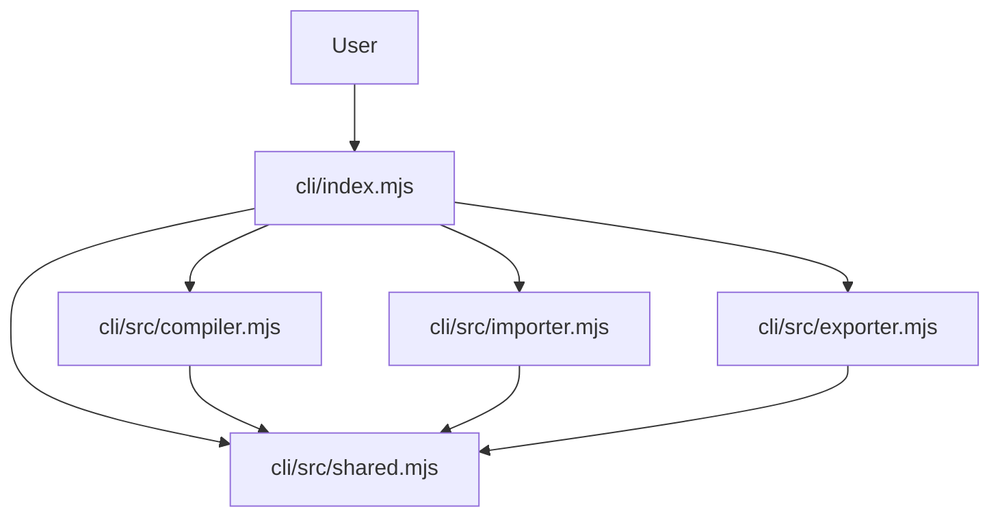

# Design Document: CLI Refactoring

## Overview

This design refactors the monolithic `cli/canvas-compile.mjs` into three focused JavaScript modules with a unified entrypoint. The refactoring maintains 100% backward compatibility while creating a clean, maintainable architecture using the existing Node.js/JavaScript ecosystem.

**Technology Stack:**
- **Language**: JavaScript (ES modules, .mjs files)
- **Runtime**: Node.js (existing setup)
- **Module System**: ES modules with explicit imports/exports
- **File Extensions**: `.mjs` for consistency with existing CLI

## Architecture



The architecture follows a hub-and-spoke pattern where:
- **cli/index.mjs**: Unified entrypoint handling CLI interface and coordination (replaces canvas-compile.mjs)
- **cli/src/compiler.mjs**: Canvas compilation and sorting logic
- **cli/src/importer.mjs**: JSON/JSONL to Canvas conversion logic
- **cli/src/exporter.mjs**: Metadata stripping and pure data output
- **cli/src/shared.mjs**: Common utilities and helper functions

**Migration Strategy:**
- Keep `cli/canvas-compile.mjs` temporarily for comparison testing
- Create new `cli/index.mjs` as the main entrypoint
- Extract functionality into `cli/src/` modules
- Update any scripts/documentation to use `cli/index.mjs`
- Remove `cli/canvas-compile.mjs` after validation

## Components and Interfaces

### Unified Entrypoint (cli/index.mjs)

**Responsibilities:**
- Command-line argument parsing and validation
- Usage help and error reporting
- Delegating to appropriate modules
- Maintaining backward compatibility

**Interface:**
```javascript
// Main entry point - maintains exact same CLI interface
async function main()

// Argument parsing - extracted from original
function parseArgs(argv)
function usage(message)
```

### Compilation Module (cli/src/compiler.mjs)

**Responsibilities:**
- Canvas to JSON compilation
- Node and edge sorting algorithms
- Flow topology analysis
- Hierarchical structure processing

**Interface:**
```javascript
// Main compilation function
export function compileCanvasAll({ input, settings })

// Core compilation logic
export function compileCanvasFile({ inPath, outPath, settings })

// Sorting algorithms
function stableSortByXY(nodes, settings, allEdges, nodePositions, isWithinGroup)
function stableEdgeSortByTopology(edges, nodePositions, settings, nodes)
function buildFlowGroups(nodes, allEdges, nodePositions)
function buildHierarchy(nodes)
function flattenHierarchical(nodes, parentMap, settings, allEdges, nodePositions)
```

### Import Module (cli/src/importer.mjs)

**Responsibilities:**
- JSON to Canvas conversion with visual scaffolding
- JSONL to Canvas conversion with grid layout
- Pure Canvas data import with semantic mapping
- Enhanced coloring and layout algorithms

**Interface:**
```javascript
// Unified import function
export function importFile({ inPath, outPath })

// Specific import functions
export function importJsonFile({ inPath, outPath })
export function importJsonlFile({ inPath, outPath })

// Core import logic
function importDataToCanvasEnhanced(filePath, fileContent)
function importJsonToCanvasEnhanced(data)
function importJsonlToCanvasEnhanced(jsonObjects)
function importPureCanvasDataCLI(data)
```

### Export Module (cli/src/exporter.mjs)

**Responsibilities:**
- Canvas metadata stripping
- Pure data structure output
- Edge processing and embedding

**Interface:**
```javascript
// Main export function
export function stripCanvasMetadata(input, settings)

// Helper functions for metadata processing
function processLabeledEdges(edges)
function embedEdgesInNodes(nodes, labeledEdges)
```

### Shared Utilities (cli/src/shared.mjs)

**Responsibilities:**
- Common utility functions used across modules
- File I/O operations
- Data validation and normalization
- Color manipulation utilities

**Interface:**
```javascript
// File operations
export function readJson(filePath)

// Data utilities
export function normalizedId(value)
export function isFiniteNumber(v)
export function getNodeSortKey(node)
export function getNodeTypePriority(node)
export function getNodeColor(node)
export function getEdgeColor(edge)
export function isDirectionalEdge(edge)
export function isContainedBy(node, group)

// Color utilities
export function hexToHsl(hex)
export function hslToHex(h, s, l)
export function mutateColor(hex, hueShift, satMult, lightMult)
export function generateRainbowGradient(count)
export function generateHierarchicalColors(baseColor, depth)

// Canvas processing utilities
export function createCanvasNodeFromSourceCLI(sourceNode, generateId)
export function extractSemanticFieldsCLI(text)
export function calculateNodeHeightCLI(node)
export function extractSemanticInfoCLI(node)
export function isPureCanvasExport(data)
```

## Data Models

### Settings Object
```javascript
{
  colorSortNodes: boolean,
  colorSortEdges: boolean,
  flowSortNodes: boolean,
  stripMetadata: boolean,
  flowSort: boolean,
  stripEdgesWhenFlowSorted: boolean,
  semanticSortOrphans: boolean
}
```

### Canvas Structure
```javascript
{
  nodes: Array<CanvasNode>,
  edges: Array<CanvasEdge>
}
```

### File Operation Result
```javascript
{
  inPath: string,
  outPath: string,
  nodesIn?: number,
  edgesIn?: number,
  nodesOut: number,
  edgesOut: number,
  recordsIn?: number
}
```

## Correctness Properties

*A property is a characteristic or behavior that should hold true across all valid executions of a system-essentially, a formal statement about what the system should do. Properties serve as the bridge between human-readable specifications and machine-verifiable correctness guarantees.*

### Converting EARS to Properties

Based on the prework analysis, I'll create properties for the testable acceptance criteria:

**Property 1: Output Equivalence**
*For any* valid input file and command-line arguments, the refactored CLI should produce identical output to the original CLI
**Validates: Requirements 1.1**

**Property 2: Flag Compatibility**
*For any* valid combination of command-line flags and options, the refactored CLI should behave identically to the original CLI
**Validates: Requirements 1.2**

**Property 3: Test File Consistency**
*For any* existing test file, processing with the refactored CLI should generate identical results to the original CLI
**Validates: Requirements 1.3**

**Property 4: Interface Preservation**
*For any* command-line argument combination, the refactored CLI should accept or reject it in the same way as the original CLI
**Validates: Requirements 1.4**

**Property 5: Error Handling Consistency**
*For any* error condition, the refactored CLI should produce the same error message and exit code as the original CLI
**Validates: Requirements 1.5**

**Property 6: Command Delegation**
*For any* CLI command, the entrypoint should delegate to the correct module based on the command type
**Validates: Requirements 3.2**

**Property 7: Argument Processing**
*For any* valid argument combination, the entrypoint should parse and validate arguments correctly
**Validates: Requirements 3.3**

**Property 8: Module Coordination**
*For any* operation requiring multiple modules, the entrypoint should coordinate them correctly to produce the expected result
**Validates: Requirements 3.4**

**Property 9: Help and Error Consistency**
*For any* help request or error condition, the entrypoint should produce identical output to the original CLI
**Validates: Requirements 3.5**

**Property 10: Performance Preservation**
*For any* input file, the refactored CLI should complete processing within the same performance bounds as the original CLI
**Validates: Requirements 4.4**

## Error Handling

The refactored CLI maintains the same error handling strategy as the original:

- **File I/O Errors**: Proper error messages for missing files, permission issues, and invalid paths
- **JSON Parsing Errors**: Clear error messages for malformed JSON/JSONL input
- **Validation Errors**: Descriptive messages for invalid Canvas structures or missing required fields
- **Argument Errors**: Usage help and specific error messages for invalid command-line arguments
- **Exit Codes**: Consistent exit codes (0 for success, 1 for runtime errors, 2 for usage errors)

Each module handles its own domain-specific errors and propagates them to the entrypoint for consistent reporting.

## Testing Strategy

### Dual Testing Approach

The refactoring requires both unit tests and property-based tests to ensure correctness:

**Unit Tests:**
- Test specific examples of each module's functionality
- Test error conditions and edge cases
- Test module interfaces and integration points
- Verify shared utility functions work correctly

**Property-Based Tests:**
- Test output equivalence across random inputs (Property 1)
- Test flag compatibility with generated argument combinations (Property 2)
- Test interface preservation with random valid/invalid arguments (Property 4)
- Test performance characteristics with various input sizes (Property 10)

**Integration Tests:**
- Test end-to-end CLI functionality
- Test coordination between modules
- Test backward compatibility with existing test files

**Property Test Configuration:**
- Minimum 100 iterations per property test
- Each property test references its design document property
- Tag format: **Feature: cli-refactoring, Property {number}: {property_text}**

The testing strategy ensures that the refactoring maintains 100% backward compatibility while improving code maintainability.