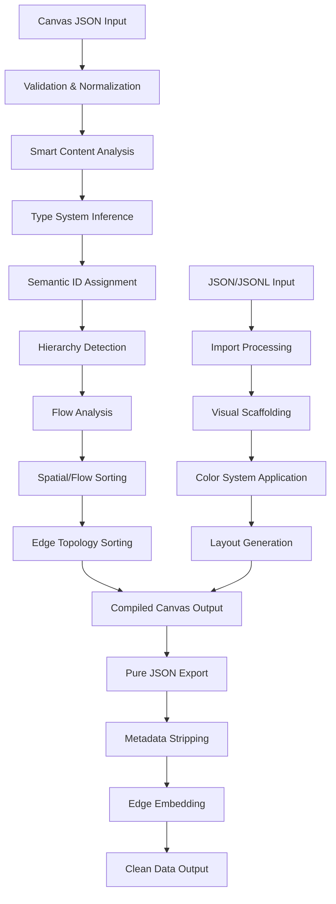

# Design Document: Semantic JSON Canvas

## Overview

The Semantic JSON Canvas system transforms Obsidian Canvas files from scrambled, position-randomized JSON into semantically ordered, human and LLM-readable documents. The system operates as an "anticompiler" that surfaces spatial meaning explicitly encoded in Canvas visual syntax while maintaining full JSON Canvas specification compliance.

The architecture consists of five main layers:
1. **Spatial Semantic Compilation** - Core ordering and hierarchy extraction
2. **Smart Content Intelligence** - YAML, Markdown, JSON, and code content parsing
3. **Emergent Type Systems** - Canvas-specific taxonomy inference and semantic ID assignment
4. **Enhanced Import/Export** - Bidirectional JSON/JSONL transformation with visual features
5. **Plugin Integration** - Obsidian plugin and CLI tool interfaces

The system preserves all original Canvas data while reordering nodes and edges based on spatial semantics, content intelligence, and inferred type systems. This creates stable Git diffs and coherent document structure that both humans and LLMs can parse without spatial reconstruction, positioning semantic-json as a "lingua franca" for structured data across formats.

## Architecture

### Core Processing Pipeline



### Layer Architecture

**Layer 1: Spatial Semantic Compilation**
- Input validation and ID normalization
- Hierarchical containment detection using bounding box analysis
- Flow topology analysis with BFS-based topological sorting
- Multi-dimensional sorting (spatial, flow, color, content)

**Layer 2: Smart Content Intelligence**
- Content type detection (YAML, Markdown, JSON, code blocks)
- Semantic key extraction from structured text content
- Intelligent sort key generation with configurable priority
- Graceful degradation to plain text fallback

**Layer 3: Emergent Type Systems**
- Canvas content pattern analysis and classification
- Locally-appropriate type taxonomy generation
- Deterministic semantic ID assignment with type encoding
- Reference consistency maintenance during ID transformation

**Layer 4: Enhanced Import/Export**
- Unified import system with auto-detection
- Visual feature generation (hierarchical coloring, rainbow gradients)
- Grid layout algorithms for optimal visual arrangement
- Metadata stripping and labeled edge embedding

**Layer 5: Plugin Integration**
- Obsidian plugin with auto-compilation and settings management
- CLI tool for batch processing and CI/CD integration
- Command registration and file system event handling

## Components and Interfaces

### Core Compilation Engine

**CompileCanvasAll Function**
```typescript
interface CompileSettings {
  colorSortNodes?: boolean;
  colorSortEdges?: boolean;
  flowSortNodes?: boolean;
  semanticSortOrphans?: boolean;
}

function compileCanvasAll({ 
  input: CanvasData, 
  settings?: CompileSettings 
}): CanvasData
```

**Responsibilities:**
- Validates node and edge IDs for uniqueness and completeness
- Builds hierarchical containment map using bounding box analysis
- Performs flow topology analysis when enabled
- Applies multi-dimensional sorting algorithm
- Returns compiled Canvas with preserved data integrity

### Flow Topology Analyzer

**FlowGroup Interface**
```typescript
interface FlowGroup {
  nodes: Set<string>;           // Node IDs in this flow group
  minY: number;                 // Top-left position for group sorting
  minX: number;
  flowOrder: Map<string, number>; // Node ID -> depth in flow
}
```

**buildFlowGroups Function**
- Analyzes edge directionality (forward, reverse, bidirectional)
- Detects connected components using undirected graph traversal
- Performs BFS-based topological sorting for flow depth assignment
- Handles cycles by assigning maximum depth + 1

### Hierarchical Containment System

**buildHierarchy Function**
- Uses precise bounding box containment detection
- Resolves overlapping groups by selecting smallest containing area
- Creates parent-child mapping for depth-first traversal
- Supports nested group structures with recursive processing

### Import System Architecture

**Unified Import Interface**
```typescript
function importDataToCanvas(filePath: string, fileContent: string): CanvasData
```

**Auto-Detection Logic:**
1. Check file extension (.json, .jsonl)
2. Analyze content structure (single object vs. multiple lines)
3. Attempt JSONL parsing for multi-line content
4. Fall back to JSON parsing with error handling

**Visual Feature Systems:**
- **Hierarchical Coloring**: HSL color mutations with hue shifts and saturation/lightness adjustments
- **Rainbow Gradients**: Cyclic hue progression with variation for multiple cycles
- **Grid Layout**: Monitor-friendly aspect ratio calculation (16:9 to 16:10)

### Smart Content Parser

**Content Detection Interface**
```typescript
interface ContentParsingSettings {
  smartContentParsing?: boolean;
  yamlKeyFields?: string[];      // Priority order: ['title', 'name', 'id']
  markdownStripFormatting?: boolean;
}

function getSmartSortKey(node: CanvasNode, settings?: ContentParsingSettings): string
```

**Content Type Detection:**
- **YAML Detection**: Text starting with `---\n` pattern
- **Markdown Detection**: Lines starting with `#` header markers
- **JSON Detection**: Text matching `^[\{\[]` pattern with valid JSON parsing
- **Code Block Detection**: Fenced code blocks with language tags

**Extraction Patterns:**
- YAML: Extract title/name field with configurable priority order
- Markdown: Extract first header with hierarchy-aware prefixing (level_title)
- JSON: Extract id/name/title keys from parsed objects
- Fallback: Plain text normalization (lowercase, trim, slice to 100 chars)

### Emergent Type System Engine

**Type Inference Interface**
```typescript
interface TypeSystem {
  [typeName: string]: string;    // Type name -> description
}

interface TypedNodeIds {
  [nodeId: string]: string;      // Original ID -> semantic typed ID
}

interface EmergentAnalysis {
  type_system: TypeSystem;
  node_ids: TypedNodeIds;
}

function inferCanvasTypology(canvas: CanvasData): EmergentAnalysis
```

**Type Inference Process:**
1. **Content Analysis**: Analyze all node content for patterns (JSON blocks, config snippets, reference material)
2. **Pattern Recognition**: Identify coherent categories (palette, legend, config::format, group::semantic)
3. **Taxonomy Generation**: Create locally-appropriate type system with descriptive names
4. **ID Assignment**: Generate semantic IDs encoding type and content hash
5. **Reference Updating**: Update all edge fromNode/toNode references to new semantic IDs

**Semantic ID Format:**
- Pattern: `{type}::{variant}::{hash}`
- Example: `palette::rose::045f`, `config::starship::a7b2`, `legend::reference::c8d9`
- Deterministic: Same content produces same ID across runs
- Collision Handling: Append numeric suffix for conflicts

### Export System Architecture

**Pure JSON Export Pipeline**
```typescript
function stripCanvasMetadata(
  input: CanvasData, 
  settings?: CompileSettings & { stripEdgesWhenFlowSorted?: boolean }
): CanvasData
```

**Labeled Edge Embedding System:**
- Separates labeled and unlabeled edges
- Creates bidirectional relationship arrays (from/to) in connected nodes
- Preserves semantic relationships while reducing edge array size
- Maintains directional flow semantics

## Data Models

### Canvas Data Structures

**CanvasNode Interface**
```typescript
interface CanvasNode {
  id: string;                    // Required: unique identifier
  type: string;                  // Required: text | file | link | group
  x?: number;                    // Spatial position
  y?: number;
  width?: number;                // Dimensions
  height?: number;
  color?: string;                // Visual taxonomy
  text?: string;                 // Content for text nodes
  file?: string;                 // Path for file nodes
  url?: string;                  // URL for link nodes
  label?: string;                // Label for group nodes
  [key: string]: unknown;       // Extensibility
}
```

**CanvasEdge Interface**
```typescript
interface CanvasEdge {
  id: string;                    // Required: unique identifier
  fromNode: string;              // Required: source node ID
  toNode: string;                // Required: target node ID
  fromEnd?: string;              // Endpoint shape: none | arrow
  toEnd?: string;                // Endpoint shape: none | arrow (default)
  fromSide?: string;             // Connection side: top | right | bottom | left
  toSide?: string;
  color?: string;                // Visual flow semantics
  label?: string;                // Relationship semantics
  [key: string]: unknown;       // Extensibility
}
```

### Sorting Key Generation

**Content Key Extraction**
- Text nodes: Extract and normalize text content
- File nodes: Extract basename from file path
- Link nodes: Preserve full URL including protocol
- Group nodes: Use label or fallback to ID
- Normalization: Lowercase, trim whitespace

**Type Priority System**
- Content nodes (text, file, group): Priority 0
- Link nodes: Priority 1 (appear after content like footnotes)

**Color Sorting System**
- Uncolored nodes: Empty string (sorts first)
- Colored nodes: Normalized color string (hex or preset)
- Consistent ordering within same spatial/flow position

### Flow Analysis Data Model

**Edge Direction Classification**
```typescript
enum EdgeDirection {
  ForwardArrow,        // fromEnd: none, toEnd: arrow (default)
  ReverseArrow,        // fromEnd: arrow, toEnd: none
  Bidirectional,       // fromEnd: arrow, toEnd: arrow
  NonDirectional       // fromEnd: none, toEnd: none (ignored)
}
```

**Topological Sorting Algorithm**
- BFS-based level assignment starting from source nodes (in-degree 0)
- Flow depth calculation using longest path from sources
- Cycle handling by assigning maximum depth + 1 to remaining nodes
- Component isolation for independent flow group processing

### Import Data Transformation

**JSON Structure Mapping**
- Objects → Group nodes with child text nodes for each key-value pair
- Arrays → Group nodes with indexed child nodes and length labels
- Primitives → Text nodes with formatted content display
- Null/undefined → Text nodes with explicit null representation

**JSONL Grid Layout Model**
```typescript
interface GridLayout {
  cols: number;                  // Calculated grid columns
  rows: number;                  // Calculated grid rows
  recordWidth: number;           // Width per record (700px)
  recordSpacing: number;         // Spacing between records (50px)
  aspectRatio: number;           // Target aspect ratio (16:9)
}
```

**Color System Models**
- **Hierarchical Colors**: Base color with progressive hue shifts (25° per level)
- **Rainbow Gradient**: Cyclic hue progression through 7 base colors
- **HSL Manipulation**: Precise color mutations with saturation/lightness adjustments

### Export Data Model

**Pure JSON Structure**
```typescript
interface PureNode {
  id: string;
  type: string;
  text?: string;                 // Content fields only
  file?: string;
  url?: string;
  label?: string;
  from?: Array<{                 // Embedded incoming relationships
    node: string;
    label: unknown;
  }>;
  to?: Array<{                   // Embedded outgoing relationships
    node: string;
    label: unknown;
  }>;
}
```

**Metadata Stripping Rules**
- Remove: x, y, width, height, color, background, backgroundStyle
- Remove: fromSide, toSide, fromEnd, toEnd for edges
- Preserve: id, type, content fields, relationship labels
- Transform: Labeled edges → embedded directional arrays

## Correctness Properties

*A property is a characteristic or behavior that should hold true across all valid executions of a system-essentially, a formal statement about what the system should do. Properties serve as the bridge between human-readable specifications and machine-verifiable correctness guarantees.*

### Property 1: Spatial Ordering Consistency
*For any* Canvas with nodes at different spatial positions, the compiled output should order nodes by y-coordinate ascending, then x-coordinate ascending, with type priority (content before links) and alphabetical content sorting as tiebreakers
**Validates: Requirements 1.1, 1.3, 1.4**

### Property 2: Hierarchical Traversal Preservation
*For any* Canvas with nested group structures, the compiled output should use depth-first traversal where each group appears immediately before all its children, and children within groups are sorted semantically rather than spatially
**Validates: Requirements 1.2, 3.3, 3.4**

### Property 3: Data Preservation Invariant
*For any* valid Canvas input, compilation should preserve all original fields and values without adding or removing data, only reordering the nodes and edges arrays
**Validates: Requirements 1.5**

### Property 4: Flow Topology Ordering
*For any* Canvas with directional edges when flow sorting is enabled, nodes connected by edges should be ordered by topological depth (BFS-based), while isolated nodes fall back to spatial sorting
**Validates: Requirements 2.1, 2.2, 2.4**

### Property 5: Edge Direction Recognition
*For any* edge configuration, the system should correctly classify edges as forward arrows (default), reverse arrows, bidirectional, or non-directional based on fromEnd and toEnd properties
**Validates: Requirements 2.5**

### Property 6: Containment Detection Accuracy
*For any* node and group with defined bounding boxes, containment should be detected when the node's bounding box falls entirely within the group's bounding box, with smallest-area resolution for overlapping groups
**Validates: Requirements 3.1, 3.2**

### Property 7: Orphan Node Handling
*For any* Canvas with orphan nodes (not contained in groups), the semanticSortOrphans setting should determine whether orphans are grouped at the top with semantic sorting or distributed spatially among groups
**Validates: Requirements 3.5**

### Property 8: Color Sorting Behavior
*For any* Canvas with colored nodes, when color sorting is enabled, nodes at the same spatial position should be grouped by color (uncolored first, then by color value), and when disabled, color should not affect ordering
**Validates: Requirements 4.1, 4.2, 4.3, 4.4, 4.5**

### Property 9: Edge Topology Sorting
*For any* Canvas with edges, spatial mode should sort edges by fromNode position then toNode position, while flow mode should sort by topological depth of connected nodes, with color grouping when enabled
**Validates: Requirements 5.1, 5.2, 5.4**

### Property 10: Edge Metadata Preservation
*For any* Canvas with edges, compilation should preserve all edge metadata including labels and directionality information (fromEnd, toEnd, fromSide, toSide)
**Validates: Requirements 5.3, 5.5**

### Property 11: Pure JSON Transformation
*For any* compiled Canvas, pure JSON export should strip spatial and visual metadata while preserving content fields, and embed labeled edges as directional arrays in connected nodes
**Validates: Requirements 6.1, 6.2, 6.3, 6.4**

### Property 12: Conditional Edge Stripping
*For any* Canvas export, when flow sorting is enabled or stripEdgesWhenFlowSorted is true, unlabeled edges should be removed from pure JSON output while labeled edges are embedded in nodes
**Validates: Requirements 6.5**

### Property 13: JSON Import Transformation
*For any* JSON object structure, import should create hierarchical Canvas groups with depth-based color mutations, converting objects to groups, arrays to indexed groups, and primitives to text nodes
**Validates: Requirements 7.1, 7.4, 7.5**

### Property 14: JSONL Import Layout
*For any* JSONL data, import should arrange records in a monitor-friendly grid layout with rainbow gradient coloring and optimal aspect ratio calculation
**Validates: Requirements 7.2**

### Property 15: Format Auto-Detection
*For any* input file, the unified import system should correctly detect JSON vs JSONL format based on file extension and content structure analysis
**Validates: Requirements 7.3**

### Property 16: Configuration-Dependent Sorting
*For any* Canvas and configuration settings, flow sorting should override spatial sorting when enabled, and orphan grouping should collect orphans at document top when enabled
**Validates: Requirements 8.3, 8.4**

### Property 17: Comprehensive Validation
*For any* invalid Canvas input (duplicate IDs, missing IDs, invalid edge references, malformed structure), the system should throw descriptive errors with specific failure details and normalize valid IDs by trimming whitespace and type coercion
**Validates: Requirements 9.1, 9.2, 9.3, 9.4, 9.5**

### Property 18: Deterministic Output Format
*For any* Canvas input, the system should produce consistent output with 2-space indentation, trailing newlines, deterministic key ordering, and identical results across multiple compilations of the same input
**Validates: Requirements 13.1, 13.2, 13.4, 13.5**

### Property 19: Smart Content Key Extraction
*For any* text node with structured content (YAML, Markdown, JSON), the smart content parser should extract semantic keys (title/name fields, headers, object keys) and use them for sorting instead of raw text content
**Validates: Requirements 11.1, 11.2, 11.3, 11.4**

### Property 20: Content Format Auto-Detection
*For any* text node content, the system should correctly identify YAML frontmatter, Markdown headers, JSON objects, and code blocks, gracefully degrading to plain text when formats are unrecognized
**Validates: Requirements 11.4, 11.5**

### Property 21: Emergent Type System Generation
*For any* canvas with diverse node content, the type inference engine should generate a coherent, locally-appropriate type taxonomy that captures the semantic patterns present in the canvas
**Validates: Requirements 12.1, 12.4**

### Property 22: Semantic ID Assignment and Reference Consistency
*For any* canvas with inferred types, semantic IDs should encode the type and content hash deterministically, and all edge references should be updated to maintain graph connectivity
**Validates: Requirements 12.2, 12.3, 12.5**

## Error Handling

### Validation Strategy
The system employs comprehensive input validation with early failure detection:

**ID Validation**
- Uniqueness checking across all nodes and edges
- Normalization of IDs (trim whitespace, coerce types to strings)
- Empty/missing ID detection with descriptive error messages

**Reference Validation**
- Edge-to-node reference integrity checking
- Orphaned edge detection (edges referencing non-existent nodes)
- Circular reference detection in hierarchical structures

**Structure Validation**
- Canvas format compliance checking
- Required field presence validation
- Type safety for numeric fields (coordinates, dimensions)

### Error Recovery
The system follows a fail-fast approach with no automatic error recovery:
- Invalid inputs result in descriptive exceptions
- No partial processing or data corruption
- Clear error messages with specific failure locations

### Graceful Degradation
For optional features, the system degrades gracefully:
- Missing spatial coordinates default to (0, 0)
- Missing dimensions default to reasonable values
- Color sorting gracefully handles mixed color formats
- Flow sorting falls back to spatial sorting for disconnected components

## Testing Strategy

### Dual Testing Approach
The system requires both unit tests and property-based tests for comprehensive coverage:

**Unit Tests**
- Specific examples demonstrating correct behavior
- Edge cases and boundary conditions
- Integration points between components
- Error conditions and validation failures

**Property-Based Tests**
- Universal properties across all valid inputs
- Randomized input generation for comprehensive coverage
- Minimum 100 iterations per property test
- Each test tagged with feature name and property reference

### Property Test Configuration
Each property-based test should:
- Run minimum 100 iterations due to randomization
- Reference its corresponding design document property
- Use tag format: **Feature: semantic-json-canvas, Property N: [property description]**
- Generate smart test data constrained to valid input spaces

### Testing Framework
The system uses Jest as the primary testing framework with:
- Custom generators for Canvas data structures
- Property testing library integration (fast-check recommended)
- Snapshot testing for output format consistency
- Performance benchmarking for large Canvas files

### Test Data Generation
Smart generators should create:
- Valid Canvas structures with realistic spatial layouts
- Hierarchical group arrangements with proper containment
- Flow graphs with various edge configurations
- Color combinations and visual metadata
- Malformed inputs for validation testing