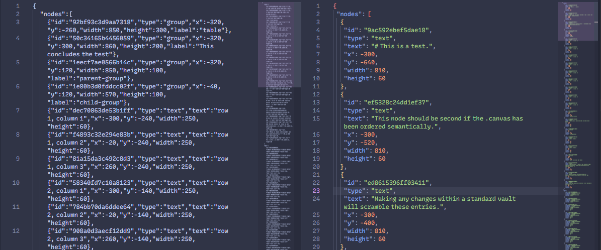

# ◈ Semantic JSON


*Default JSON Canvas vs Semantic JSON - both render identically in Obsidian*

## ⚡Features

- **Auto-compile on save**: Canvas files arrange their contents intelligently instead of scrambling
- **Intuitive JSON**: Watch your no-code JSON structures self-assemble in real-time IDE
- **Pure JSON imports ⇄ exports:** import structure to Canvas, author visually, export clean semantic JSON
- **Diff stability**: Git **only** tracks meaningful changes, LLMs output/consume coherent structure, humans see legible visual feedback
- **CLI tool**: Included for batch processing or CI pipelines
- **Spec-compliant**: Pure JSON Canvas extension—no custom properties, works with all Canvas tools

## 🎯 Why this Plugin?

Obsidian's default handling of the JSON array in Canvas files incidentally discards visually encoded meaning, forcing readers to reconstruct intent. This plugin recompiles the z-index, preserving its semantics as legible, deterministic JSON across four dimensions:

- 📍 **Position** (x, y) → Linear reading sequence (top-left to bottom-right)
- 📦 **Containment** (bounding boxes) → Hierarchical structure (groups + children)
- 🎨 **Color** (node/edge colors) → Semantic taxonomy (red=urgent, blue=reference, etc.)
- ➡️ **Directionality** (arrow endpoints) → Information flow topology (source → sink)

### This greatly **enhances collaboration** between human and machine intelligence.

- **JSON Canvas** format becomes a *lingua franca* for the shared visuospatial grammar that people and AI already use natively.
- **Obsidian Canvas** becomes a full *WYSIWYG* authoring tool for this richly contextual JSON format.

## 🌐 Installation

### Early Access / Beta Installation

Use BRAT (Beta Reviewer's Auto-update Tool) to install:

1. Install BRAT from Obsidian Community Plugins
2. Open Command Palette → "BRAT: Add beta plugin"
3. Paste: https://github.com/SyntaxAsSpiral/semantic-json
4. Add & enable the plugin

### Manual Installation

1. Download the latest release from [GitHub Releases](https://github.com/SyntaxAsSpiral/semantic-json/releases)
2. Extract to `<vault>/.obsidian/plugins/semantic-json/`
3. Reload Obsidian
4. Enable "Semantic JSON" in Community Plugins settings

## 🎮 Usage

### Commands (via Command Palette)

- 💫 **"Compile active canvas"**: Recompiles the `.canvas` file in-place preserving semantic structure
- 📥 **"Import JSON to Canvas"**: Creates visual scaffolding from JSON (objects/arrays → groups, primitives → text nodes)
- 📤 **"Export as pure JSON"**: Strips Canvas metadata, exports clean data artifact (`.pure.json`)

### Settings

- 🪄 **Auto-compile on save** (default: enabled): Automatically reorder canvas files when saved
- 🎨 **Color sort nodes** (default: enabled): Group nodes by color within same spatial position
- 📲 **Color sort edges** (default: enabled): Group edges by color within same topology
- 🔗 **Flow sort nodes** (default: disabled): Sort by directional flow topology instead of spatial position

## Standalone CLI Tool

Enables batch processing, CI/CD pipelines, and programmatic canvas compilation.

```bash
# Import JSON to Canvas (create visual scaffolding)
node cli/canvas-compile.mjs --from-json data.json

# Compile to semantic JSON Canvas
node cli/canvas-compile.mjs --in <path-to-.canvas>

# Export pure data artifact (strip metadata)
node cli/canvas-compile.mjs --in file.canvas --strip-metadata

# Options
--from-json                       # Import JSON to Canvas
--color-nodes / --no-color-nodes  # Color sorting (default: true)
--color-edges / --no-color-edges  # Edge color sorting (default: true)
--flow-sort / --no-flow-sort      # Flow topology sorting (default: false)
--strip-metadata                  # Strip Canvas metadata for pure JSON export
```

## 📖 What is JSON Canvas?

[JSON Canvas](https://jsoncanvas.org/) is an open file format for infinite canvas data, originally developed for Obsidian Canvas. It promotes longevity, readability, interoperability, and extensibility using the `.canvas` extension and a simple JSON structure with nodes and edges. Infinite canvas tools organize information **spatially** like a digital whiteboard.

### Compilation Process
[Full documentation](./semantic-json-spec.md)

- **Hierarchical ordering**: Groups followed immediately by their contents, depth-first traversal
- **Content-based sorting**: Nodes sort by semantic content (text/file name/URL/label) instead of random IDs
- **Color taxonomy**: Optional color grouping preserves visual categories (enabled by default)
- **Flow topology sorting**: Optional directional flow analysis—arrows define sequence, superceding positional sorting for nodes (disabled by default)
- **Topology-based edge sorting**: Edges ordered by connected node positions (or flow depth when flow sorting enabled)

This transforms spatial diagrams into linear narratives that preserve visual semantics, making flow diagrams, system architectures, and knowledge graphs immediately legible to readers in JSON without spatial reconstruction.

## 🧪 Examples

See [`examples/`](./examples/) for a self-documenting test. The test card canvas is pre-sorted in the repo, so opening it in Obsidian and saving will scramble the entries, demonstrating exactly what this plugin fixes. The JSON version shows it stripped of Canvas metadata.

## Development

```bash
npm install
npm run dev    # Watch mode
npm run build  # Production build
```

## Contributing

Issues and PRs welcome! Please follow existing code style and include tests for new features.

## License

MIT

---

**Transforms visual canvases into semantic narratives—reading spatial field as language, compiling visual meaning into linear order.**
